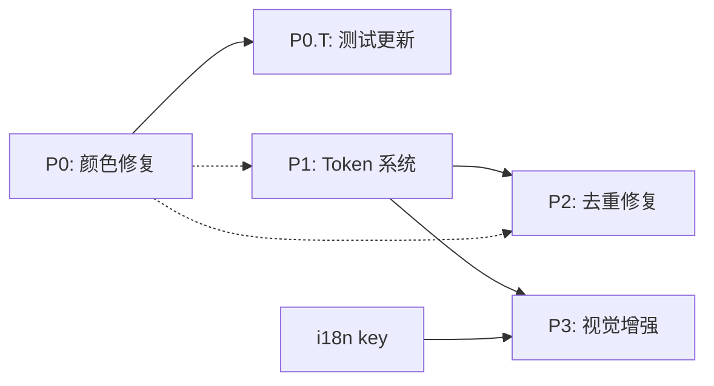

# 功能规划：全站视觉升级 -- 现代简约风格统一

**规划时间**：2026-03-22
**预估工作量**：12 任务点

---

## 1. 功能概述

### 1.1 目标

将全站视觉风格从当前混用 `gray` / `zinc` 的不一致状态，统一升级为以 `zinc` 为中性色的现代简约风格。同时建立设计 Token 系统、去重背景图案代码、增强骨架屏/空状态/暗色视觉效果。

### 1.2 范围

**包含**：
- P0: 颜色一致性修复（gray -> zinc，6 文件）
- P1: 设计 Token 系统建立（boxShadow, 动画, focus-visible，2 文件）
- P2: 去重和语义修复（背景图案提取为 class，`<a>` -> `<NuxtLink>`，4 文件）
- P3: 视觉增强（骨架屏 shimmer、空状态升级、暗色 glow、TOC 指示条，5-6 文件）
- i18n 新增 key

**不包含**：
- 组件逻辑/数据流变更
- 新增页面或路由
- 服务端代码变更
- 响应式布局重构

### 1.3 技术约束

- 仅 Tailwind CSS class 变更，不引入新依赖
- 必须同时支持 light/dark 两种主题
- 变更后现有测试必须通过（PrevNextNav 测试需适配选择器变更）
- 遵循项目 Conventional Commits 规范

---

## 2. WBS 任务分解

### 2.1 分解结构图

```mermaid
graph TD
    A[全站视觉升级] --> P0[P0: 颜色一致性修复]
    A --> P1[P1: 设计 Token 系统]
    A --> P2[P2: 去重和语义修复]
    A --> P3[P3: 视觉增强]
    A --> I18N[i18n 新增 key]

    P0 --> P0A[tailwind.config.ts]
    P0 --> P0B[Pagination.vue]
    P0 --> P0C[ArticleMeta.vue]
    P0 --> P0D[RelatedArticles.vue]
    P0 --> P0E[PrevNextNav.vue]
    P0 --> P0F["[...slug].vue L172"]

    P1 --> P1A[tailwind.config.ts boxShadow]
    P1 --> P1B[main.css 动画/工具类]

    P2 --> P2A[default.vue]
    P2 --> P2B[article.vue]
    P2 --> P2C[AppFooter.vue]
    P2 --> P2D[ReadingNavigator.vue]

    P3 --> P3A[index.vue]
    P3 --> P3B[categories/index.vue]
    P3 --> P3C[archives.vue]
    P3 --> P3D[ArticleCard.vue]
    P3 --> P3E[TableOfContents.vue]
    P3 --> P3F["[...slug].vue 描述区"]
```



### 2.2 任务清单

---

#### 批次 P0：颜色一致性修复（3 任务点）

> **目标**：消除全站 `gray-*` 残留，统一为 `zinc-*`。此批次为纯文本替换，风险极低。

##### 任务 P0.1：typography 插件颜色统一（0.5 点）

**文件**: `tailwind.config.ts`

- [ ] 将 typography `DEFAULT.css` 中 4 处 `colors.gray.*` 替换为 `colors.zinc.*`
  - **变更点**：
    1. L50: `'--tw-prose-body': theme('colors.gray.700')` -> `theme('colors.zinc.700')`
    2. L51: `'--tw-prose-headings': theme('colors.gray.900')` -> `theme('colors.zinc.900')`
    3. L59: `'--tw-prose-body': theme('colors.gray.300')` -> `theme('colors.zinc.300')`
    4. L60: `'--tw-prose-headings': theme('colors.gray.100')` -> `theme('colors.zinc.100')`
  - **验证**：`pnpm dev` 启动后文章正文/标题颜色无视觉差异（gray 和 zinc 色值接近但 zinc 略偏冷）

##### 任务 P0.2：Pagination 组件颜色 + 圆角修复（0.5 点）

**文件**: `app/components/blog/Pagination.vue`

- [ ] 全文 `gray` -> `zinc` 替换（共约 12 处）
  - **涉及行**：L65-69（prev 按钮）、L84（省略号）、L92-97（页码按钮）、L108-112（next 按钮）
  - **具体替换**：
    - `text-gray-700` -> `text-zinc-700`
    - `hover:bg-gray-100` -> `hover:bg-zinc-100`
    - `dark:text-gray-300` -> `dark:text-zinc-300`
    - `dark:hover:bg-gray-800` -> `dark:hover:bg-zinc-800`
    - `text-gray-400` -> `text-zinc-400`
    - `dark:text-gray-600` -> `dark:text-zinc-600`
- [ ] 按钮圆角 `rounded-lg` -> `rounded-xl`（L65, L92, L108 三处）
- **验证**：分页导航各状态（hover、active、disabled）颜色与全站一致

##### 任务 P0.3：ArticleMeta 组件颜色修复（0.5 点）

**文件**: `app/components/blog/ArticleMeta.vue`

- [ ] 全文 `gray` -> `zinc` 替换（共约 10 处）
  - **涉及位置**：
    - L26: 容器 `text-gray-600 dark:text-gray-400` -> `text-zinc-600 dark:text-zinc-400`
    - L44, L67, L93: 分隔线 `bg-gray-300 dark:bg-gray-700` -> `bg-zinc-300 dark:bg-zinc-700`
    - L84: 标签 `bg-gray-100` -> `bg-zinc-100`，`dark:bg-gray-800` -> `dark:bg-zinc-800`
- **验证**：文章详情页 meta 信息颜色统一

##### 任务 P0.4：RelatedArticles 组件修复（1 点）

**文件**: `app/components/blog/RelatedArticles.vue`

- [ ] 全文 `gray` -> `zinc` 替换
  - L25: `border-gray-200 dark:border-gray-800` -> `border-zinc-200 dark:border-zinc-800`
  - L26: `text-gray-900 dark:text-gray-100` -> `text-zinc-900 dark:text-zinc-100`
  - L35: 卡片 `border-gray-200 bg-white dark:border-gray-800 dark:bg-gray-900` -> `border-zinc-200/60 bg-white/60 dark:border-zinc-800/60 dark:bg-zinc-900/50`
  - L52: 标题 `text-gray-900 dark:text-gray-100` -> `text-zinc-900 dark:text-zinc-100`
  - L58: 日期 `text-gray-500 dark:text-gray-500` -> `text-zinc-500 dark:text-zinc-500`
- [ ] `<a>` -> `<NuxtLink>`，`href` -> `to`（L31-33）
  - 将 `<a v-for="..." :href="article.path"` 改为 `<NuxtLink v-for="..." :to="article.path"`
  - 对应闭合标签 `</a>` -> `</NuxtLink>`（L63）
- [ ] 卡片加毛玻璃效果：添加 `backdrop-blur-md`
- [ ] 卡片圆角升级：`rounded-lg` -> `rounded-2xl`
- **验证**：
  1. 相关文章卡片点击使用客户端导航（不触发整页刷新）
  2. 视觉风格与 ArticleCard 一致

##### 任务 P0.5：PrevNextNav 组件修复（0.5 点）

**文件**: `app/components/blog/PrevNextNav.vue`

- [ ] 全文 `gray` -> `zinc` 替换
  - L16: `border-gray-200 dark:border-gray-800` -> `border-zinc-200 dark:border-zinc-800`
  - L21: 卡片 `border-gray-200 dark:border-gray-800` -> `border-zinc-200/60 dark:border-zinc-800/60`
  - L24: 箭头 `text-gray-400 dark:text-gray-600` -> `text-zinc-400 dark:text-zinc-600`
  - L32: 标签 `text-gray-500 dark:text-gray-500` -> `text-zinc-500 dark:text-zinc-500`
  - L34: 标题 `text-gray-900 dark:text-gray-100` -> `text-zinc-900 dark:text-zinc-100`
  - L46, L49-51, L57: 同上模式
- [ ] `<a>` -> `<NuxtLink>`，`href` -> `to`
  - L18: `<a v-if="prev" :href="prev.path"` -> `<NuxtLink v-if="prev" :to="prev.path"`
  - L39: `</a>` -> `</NuxtLink>`
  - L43: `<a v-if="next" :href="next.path"` -> `<NuxtLink v-if="next" :to="next.path"`
  - L64: `</a>` -> `</NuxtLink>`
- [ ] 卡片加毛玻璃效果：添加 `backdrop-blur-md bg-white/60 dark:bg-zinc-900/50`
- **验证**：
  1. 上/下篇链接使用客户端导航
  2. hover 效果正常

##### 任务 P0.6：文章详情页标签分隔线颜色修复（0.5 点）

**文件**: `app/pages/[...slug].vue`

- [ ] L172: `border-gray-200 dark:border-gray-800` -> `border-zinc-200 dark:border-zinc-800`
- **验证**：文章底部标签区分隔线颜色与页面其他分隔线一致

##### 任务 P0.T：PrevNextNav 测试更新（0.5 点）

**文件**: `tests/components/blog/PrevNextNav.test.ts`

- [ ] 将所有 `wrapper.findAll('a')` 选择器更新
  - 由于 `<NuxtLink>` 在测试环境中渲染为 `<a>` 或 `<router-link-stub>`，需要验证测试框架的实际行为
  - **方案 A**（优先）：如果 `happy-dom` + `@vue/test-utils` 将 `NuxtLink` stub 为 `<a>`，则无需改动选择器
  - **方案 B**：如果渲染为 `<router-link-stub>`，需改为 `wrapper.findAllComponents({ name: 'NuxtLink' })` 或 `wrapper.findAll('router-link-stub')`
  - **验证方法**：运行 `pnpm test:run` 先观察测试结果再决定
- **验证**：`pnpm test:run -- tests/components/blog/PrevNextNav.test.ts` 全部通过

---

#### 批次 P1：设计 Token 系统（2 任务点）

> **目标**：建立可复用的 shadow token 和动画工具类，为 P3 视觉增强提供基础。

##### 任务 P1.1：tailwind.config.ts 新增 boxShadow token（1 点）

**文件**: `tailwind.config.ts`

- [ ] 在 `theme.extend` 中新增 `boxShadow` 配置：
  ```typescript
  boxShadow: {
    'token-sm': '0 1px 2px rgba(0,0,0,0.04), 0 1px 3px rgba(0,0,0,0.06)',
    'token-md': '0 4px 6px -1px rgba(0,0,0,0.05), 0 2px 4px -2px rgba(0,0,0,0.05)',
    'token-lg': '0 10px 15px -3px rgba(0,0,0,0.05), 0 4px 6px -4px rgba(0,0,0,0.05)',
    'token-xl': '0 20px 25px -5px rgba(0,0,0,0.05), 0 8px 10px -6px rgba(0,0,0,0.05)',
    'glow-primary': '0 0 20px rgba(92,110,242,0.15)',
    'glow-primary-lg': '0 0 40px rgba(92,110,242,0.2)',
  },
  ```
- **验证**：`pnpm dev` 无构建错误，`shadow-token-md` 等 class 可用

##### 任务 P1.2：main.css 新增动画和工具类（1 点）

**文件**: `app/assets/css/main.css`

- [ ] 在 `@layer components` 末尾（KaTeX 之前）新增：
  ```css
  /* Skeleton shimmer animation */
  .skeleton-shimmer {
    @apply relative overflow-hidden;
  }
  .skeleton-shimmer::after {
    content: '';
    @apply absolute inset-0;
    background: linear-gradient(90deg, transparent, rgba(255,255,255,0.4), transparent);
    animation: shimmer 1.5s infinite;
  }
  .dark .skeleton-shimmer::after {
    background: linear-gradient(90deg, transparent, rgba(255,255,255,0.06), transparent);
  }

  @keyframes shimmer {
    0% { transform: translateX(-100%); }
    100% { transform: translateX(100%); }
  }
  ```
- [ ] 新增 `bg-dot-pattern` 工具类：
  ```css
  .bg-dot-pattern {
    @apply bg-[radial-gradient(#e5e7eb_1px,transparent_1px)] dark:bg-[radial-gradient(#27272a_1px,transparent_1px)] [background-size:24px_24px];
  }
  ```
- [ ] 新增统一 `focus-visible` 样式：
  ```css
  /* Unified focus-visible ring */
  .focus-ring {
    @apply focus-visible:outline-none focus-visible:ring-2 focus-visible:ring-primary-500/50 focus-visible:ring-offset-2 focus-visible:ring-offset-white dark:focus-visible:ring-offset-zinc-950;
  }
  ```
- **验证**：
  1. 在浏览器中临时给任意元素加 `skeleton-shimmer` class，确认动画效果
  2. `bg-dot-pattern` 渲染结果与原内联样式一致

---

#### 批次 P2：去重和语义修复（2 任务点）

> **目标**：将重复的背景图案内联样式替换为 P1 建立的 `bg-dot-pattern` class，修复语义问题（`<a>` -> `<NuxtLink>`）。
> **依赖**：P1.2（`bg-dot-pattern` class 定义）

##### 任务 P2.1：default.vue 背景图案去重（0.5 点）

**文件**: `app/layouts/default.vue`

- [ ] L8: 将 `bg-[radial-gradient(#e5e7eb_1px,transparent_1px)] dark:bg-[radial-gradient(#27272a_1px,transparent_1px)] [background-size:24px_24px]` 替换为 `bg-dot-pattern`
  - 变更前：`<div class="absolute inset-0 bg-[radial-gradient(#e5e7eb_1px,transparent_1px)] dark:bg-[radial-gradient(#27272a_1px,transparent_1px)] [background-size:24px_24px] opacity-40">`
  - 变更后：`<div class="absolute inset-0 bg-dot-pattern opacity-40">`
- **验证**：页面背景图案视觉无变化

##### 任务 P2.2：article.vue 背景图案去重（0.5 点）

**文件**: `app/layouts/article.vue`

- [ ] L9: 同 P2.1 替换模式
  - 变更后：`<div class="absolute inset-0 bg-dot-pattern opacity-40">`
- **验证**：文章布局背景图案视觉无变化

##### 任务 P2.3：AppFooter.vue 背景图案去重（0.5 点）

**文件**: `app/components/layout/AppFooter.vue`

- [ ] L16: 将相同的内联背景图案替换为 `bg-dot-pattern`
  - 变更前：`<div class="absolute inset-0 bg-[radial-gradient(#e5e7eb_1px,transparent_1px)] dark:bg-[radial-gradient(#27272a_1px,transparent_1px)] [background-size:24px_24px] opacity-50">`
  - 变更后：`<div class="absolute inset-0 bg-dot-pattern opacity-50">`
- **验证**：Footer 背景图案视觉无变化

##### 任务 P2.4：ReadingNavigator.vue 语义修复（0.5 点）

**文件**: `app/components/blog/ReadingNavigator.vue`

- [ ] L85: `<a>` -> `<NuxtLink>`，`href` -> `to`
  - 变更前：`<a v-for="item in group.articles" :key="item.path" :href="item.path" ...>`
  - 变更后：`<NuxtLink v-for="item in group.articles" :key="item.path" :to="item.path" ...>`
  - 对应闭合标签 L105: `</a>` -> `</NuxtLink>`
- **验证**：左侧阅读导航器链接使用客户端导航

---

#### 批次 P3：视觉增强（4 任务点）

> **目标**：提升骨架屏、空状态、暗色模式的视觉表现力。
> **依赖**：P1.2（skeleton-shimmer 动画、glow token）

##### 任务 P3.1：首页视觉增强（1.5 点）

**文件**: `app/pages/index.vue`

- [ ] **Hero 标题渐变**（L35 附近）：
  - 首页 Hero 的 h1 `<span>` "AI 知识库" 添加渐变效果
  - 查找 Hero 标题，给主标题文字加 `bg-gradient-to-r from-zinc-900 via-primary-700 to-primary-600 dark:from-zinc-100 dark:via-primary-300 dark:to-primary-400 bg-clip-text text-transparent`
  - 需确认具体行号和元素结构

- [ ] **骨架屏升级**（L92-106）：
  - 将 `animate-pulse` 替换/增强为 `skeleton-shimmer`
  - 给每个占位块添加 `skeleton-shimmer` class
  - 变更前：`<div class="animate-pulse">`
  - 变更后：`<div class="animate-pulse skeleton-shimmer">`（两者叠加或仅用 shimmer）
  - 骨架块颜色保持 `bg-zinc-100 dark:bg-zinc-800`

- [ ] **空状态升级**（L117-122）：
  - 添加空状态图标（SVG 文档图标）
  - 添加 `blog.emptyHint` 提示文本
  - 变更后结构：
    ```html
    <div v-else class="text-center py-20 bg-zinc-50/50 dark:bg-zinc-900/30 rounded-3xl border border-dashed border-zinc-200 dark:border-zinc-800">
      <svg class="mx-auto h-12 w-12 text-zinc-300 dark:text-zinc-700 mb-4" ...>...</svg>
      <p class="text-zinc-400 dark:text-zinc-500 text-lg font-medium">{{ t('blog.empty') }}</p>
      <p class="text-zinc-400 dark:text-zinc-500 text-sm mt-2">{{ t('blog.emptyHint') }}</p>
    </div>
    ```
- **验证**：
  1. Hero 标题呈现渐变色效果
  2. 加载骨架有光泽扫描动画
  3. 空状态有图标和提示文案

##### 任务 P3.2：分类列表页骨架屏升级（0.5 点）

**文件**: `app/pages/categories/index.vue`

- [ ] L36-46 骨架屏：添加 `skeleton-shimmer` class
- [ ] L60-65 空状态：添加图标和 hint 文案（复用 P3.1 的空状态模式）
- **验证**：分类页加载态有 shimmer 效果

##### 任务 P3.3：归档页空状态升级（0.5 点）

**文件**: `app/pages/archives.vue`

- [ ] L79-84 空状态：添加图标和 hint 文案
- **验证**：归档页空状态视觉一致

##### 任务 P3.4：ArticleCard 暗色 glow 增强（0.5 点）

**文件**: `app/components/blog/ArticleCard.vue`

- [ ] L34: Hover Glow 增强暗色效果
  - 变更前：`from-primary-500/5 to-purple-500/5`
  - 变更后：`from-primary-500/5 dark:from-primary-500/10 to-purple-500/5 dark:to-purple-500/10`
- **验证**：暗色模式下文章卡片 hover 有更明显的发光效果

##### 任务 P3.5：TableOfContents 活跃态指示条（0.5 点）

**文件**: `app/components/blog/TableOfContents.vue`

- [ ] 为 TOC 活跃项添加左侧指示条效果
  - 当前活跃态仅有颜色变化 + `translate-x-1`
  - 增强方案：在 `<ul>` 的 `border-l-2` 基础上，为活跃项添加一个伪元素或使用 `border-l-2 border-primary-500` 覆盖
  - 具体实现：给活跃态按钮增加 `relative` 并添加 `before:` 伪元素指示条
    ```
    activeId === link.id
      ? 'text-primary-600 dark:text-primary-400 translate-x-1 before:absolute before:-left-[calc(0.75rem+2px)] before:top-1/2 before:-translate-y-1/2 before:h-4 before:w-0.5 before:rounded-full before:bg-primary-500'
      : ...
    ```
- **验证**：TOC 当前活跃项左侧有 primary 色指示条

##### 任务 P3.6：文章详情页描述区微调（0.5 点）

**文件**: `app/pages/[...slug].vue`

- [ ] L162: 描述区 `border-l-4` -> `border-l-2` 微调边框宽度
  - 当前 `border-l-4 border-primary-500` 略显粗重
  - 变更后更贴合现代简约风格
- **验证**：文章描述区左侧边框宽度适中

---

#### 批次 i18n：翻译 key 新增（0.5 任务点）

##### 任务 I18N.1：新增 `blog.emptyHint` 翻译（0.5 点）

**文件**: `locales/zh-CN.json` + `locales/en.json`

- [ ] zh-CN.json `blog` 对象中新增：
  ```json
  "emptyHint": "试试切换分类或标签筛选条件"
  ```
- [ ] en.json `blog` 对象中新增：
  ```json
  "emptyHint": "Try switching categories or tag filters"
  ```
- **验证**：`t('blog.emptyHint')` 在中/英文环境下正确返回

---

## 3. 依赖关系

### 3.1 依赖图



### 3.2 依赖说明

| 任务 | 依赖于 | 原因 |
|------|--------|------|
| P0.T | P0.5 | PrevNextNav `<a>` -> `<NuxtLink>` 后需验证测试选择器 |
| P2.1-P2.3 | P1.2 | 需要 `bg-dot-pattern` class 先定义 |
| P2.4 | 无 | 独立的语义修复，可与 P1 并行 |
| P3.1-P3.3 | P1.2 | 需要 `skeleton-shimmer` 动画先定义 |
| P3.1 | I18N.1 | 空状态需要 `blog.emptyHint` 翻译 key |
| P3.4-P3.6 | 无 | 独立视觉调整 |

### 3.3 并行任务

以下任务可以并行开发：
- P0（全部 6 个子任务）互相独立，可并行
- P1.1 || P1.2（boxShadow 和 CSS 互不依赖）
- P2.4 || P2.1-P2.3（语义修复不依赖 bg-dot-pattern）
- P3.4 || P3.5 || P3.6（三个独立组件的视觉调整）
- I18N.1 可在任意时间完成

### 3.4 推荐执行顺序

```
Phase 1: P0.1 -> P0.2 -> P0.3 -> P0.4 -> P0.5 -> P0.6 -> P0.T
          (原子 commit: "fix: unify gray to zinc across components")

Phase 2: P1.1 + P1.2 + I18N.1 (并行)
          (原子 commit: "feat: add design token system and i18n keys")

Phase 3: P2.1 + P2.2 + P2.3 + P2.4 (并行)
          (原子 commit: "refactor: extract bg-dot-pattern and fix semantic links")

Phase 4: P3.1 -> P3.2 -> P3.3 -> P3.4 + P3.5 + P3.6 (后三个并行)
          (原子 commit: "feat: enhance skeleton shimmer, empty states, and dark mode glow")
```

---

## 4. 实施建议

### 4.1 技术选型

| 需求 | 推荐方案 | 理由 |
|------|----------|------|
| 颜色统一 | 全局搜索替换 `gray` -> `zinc` | 项目已定义 zinc 调色板，gray 为 Tailwind 默认色，两者色值接近但 zinc 更偏冷调 |
| 骨架屏动画 | CSS `@keyframes` + `::after` 伪元素 | 纯 CSS 实现，无 JS 开销，比 `animate-pulse` 更精致 |
| 背景去重 | Tailwind `@layer components` 工具类 | 保持 Tailwind-first 风格，避免自定义 SCSS |
| 语义链接 | `<NuxtLink>` | Nuxt 内置客户端路由组件，避免整页刷新 |

### 4.2 潜在风险

| 风险 | 影响 | 缓解措施 |
|------|------|----------|
| `gray` -> `zinc` 替换遗漏 | 低 | 全局搜索 `gray-` 确认无遗漏；本方案已逐行标注 |
| PrevNextNav 测试选择器失效 | 中 | 先运行测试确认 NuxtLink 在 happy-dom 中的渲染行为；准备两种方案 |
| `skeleton-shimmer` 在某些浏览器性能问题 | 低 | 仅在加载态使用，元素数量有限；使用 `will-change: transform` 优化 |
| `bg-dot-pattern` 与 `index.vue` Hero 的 `[background-size:16px_16px]` 不一致 | 低 | Hero 背景使用独立的 16px 尺寸，不替换，仅替换 24px 的三处 |

### 4.3 测试策略

- **单元测试**：仅 PrevNextNav 测试需更新选择器（P0.T）
- **手动验证**（每个批次完成后）：
  1. Light / Dark 模式切换，确认颜色无异常
  2. 文章详情页完整流程：Meta -> 正文 -> 标签 -> 前后篇 -> 相关文章
  3. 首页骨架屏 -> 文章列表 -> 分页 -> 空状态
  4. 分类/归档页空状态
- **回归验证**：`pnpm test:run` 全部通过
- **构建验证**：`pnpm build` 无错误

---

## 5. 验收标准

功能完成需满足以下条件：

- [ ] 全站无 `gray-` class 残留（`grep -r "gray-" app/ --include="*.vue"` 返回 0 结果）
- [ ] typography 插件使用 zinc 色值
- [ ] 所有内部链接使用 `<NuxtLink>`（无 `<a :href>` 用于站内导航）
- [ ] 背景点阵图案使用 `bg-dot-pattern` class（3 处去重完成）
- [ ] `skeleton-shimmer` 动画在首页/分类页正常运行
- [ ] 空状态有图标和提示文案
- [ ] `pnpm test:run` 全部通过
- [ ] `pnpm build` 无错误
- [ ] Light / Dark 双模式视觉验收通过

---

## 6. 涉及文件清单

| # | 文件路径 | 批次 | 变更类型 |
|---|----------|------|----------|
| 1 | `tailwind.config.ts` | P0 + P1 | gray->zinc, boxShadow token |
| 2 | `app/assets/css/main.css` | P1 | 新增动画/工具类 |
| 3 | `app/components/blog/Pagination.vue` | P0 | gray->zinc, 圆角 |
| 4 | `app/components/blog/ArticleMeta.vue` | P0 | gray->zinc |
| 5 | `app/components/blog/RelatedArticles.vue` | P0 | gray->zinc, `<a>`->`<NuxtLink>`, 毛玻璃 |
| 6 | `app/components/blog/PrevNextNav.vue` | P0 | gray->zinc, `<a>`->`<NuxtLink>`, 毛玻璃 |
| 7 | `app/pages/[...slug].vue` | P0 + P3 | gray->zinc (L172), border 微调 (L162) |
| 8 | `app/layouts/default.vue` | P2 | bg-dot-pattern |
| 9 | `app/layouts/article.vue` | P2 | bg-dot-pattern |
| 10 | `app/components/layout/AppFooter.vue` | P2 | bg-dot-pattern |
| 11 | `app/components/blog/ReadingNavigator.vue` | P2 | `<a>`->`<NuxtLink>` |
| 12 | `app/pages/index.vue` | P3 | Hero 渐变, 骨架屏, 空状态 |
| 13 | `app/pages/categories/index.vue` | P3 | 骨架屏, 空状态 |
| 14 | `app/pages/archives.vue` | P3 | 空状态 |
| 15 | `app/components/blog/ArticleCard.vue` | P3 | 暗色 glow |
| 16 | `app/components/blog/TableOfContents.vue` | P3 | 活跃态指示条 |
| 17 | `locales/zh-CN.json` | i18n | 新增 emptyHint |
| 18 | `locales/en.json` | i18n | 新增 emptyHint |
| 19 | `tests/components/blog/PrevNextNav.test.ts` | P0.T | 选择器适配 |
