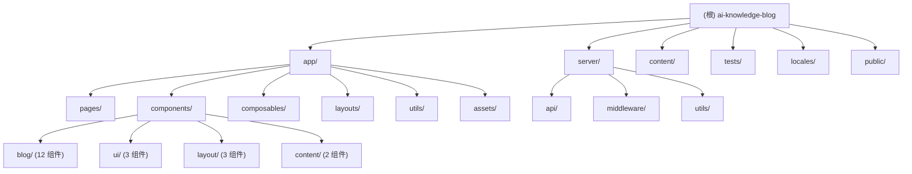

# AI Knowledge Blog - CLAUDE.md

## 变更记录 (Changelog)

| 日期 | 操作 | 说明 |
|------|------|------|
| 2026-03-22 | 初始创建 | 首次全仓扫描，生成根级与模块级文档 |

---

## 项目愿景

AI 知识库博客 -- 基于 Nuxt 3 + Vue 3 + TypeScript 的个人技术博客系统。使用 `@nuxt/content` 管理 Markdown 文章内容，支持 i18n 国际化（中/英）、暗色/亮色主题切换、私密文章加密访问、KaTeX 数学公式渲染、Shiki 代码高亮等功能。部署目标为 Vercel。

---

## 架构总览

- **框架**: Nuxt 3 (compatibilityVersion 4) + Vue 3 Composition API
- **语言**: TypeScript (strict)
- **样式**: Tailwind CSS 3 + `@tailwindcss/typography`
- **内容管理**: `@nuxt/content` v3，Markdown 文件驱动，SQLite 查询
- **国际化**: `@nuxtjs/i18n`，中文（默认）+ 英文，`prefix_except_default` 策略
- **暗色模式**: `@nuxtjs/color-mode`，class-based，跟随系统偏好
- **图片优化**: `@nuxt/image`，WebP/AVIF 格式
- **SEO**: `@nuxtjs/sitemap`，自动生成 sitemap，私密内容排除
- **代码质量**: ESLint + Prettier，`@nuxt/eslint`
- **测试**: Vitest + `@vue/test-utils` + `happy-dom`
- **包管理**: pnpm

### 关键架构决策

1. **Nuxt 4 兼容模式**: `future.compatibilityVersion: 4`，源码位于 `app/` 目录
2. **客户端私密认证**: HMAC-SHA256 签名的 HttpOnly Cookie，24 小时过期，timing-safe 比对
3. **内容查询过滤**: 私密文章在客户端 composable 层统一过滤（非 SQL 层），依赖 `isUnlocked` 状态
4. **无 SSR 认证状态泄漏**: 服务端 middleware 注入 `event.context.isPrivateAdmin`，通过 `useState` 同步至客户端

---

## 模块结构图



---

## 模块索引

| 模块路径 | 职责 | 语言 | 入口文件 | 测试 |
|----------|------|------|----------|------|
| `app/` | Nuxt 前端应用：页面、组件、composables、工具函数 | Vue/TS | `app/app.vue` | `tests/` |
| `server/` | Nitro 服务端：认证 API、中间件、密码工具 | TS | `server/api/admin-login.post.ts` | 无 |
| `content/` | Markdown 文章内容（公开 + 私密） | Markdown | N/A | N/A |
| `locales/` | i18n 翻译文件 | JSON | `locales/zh-CN.json`, `locales/en.json` | N/A |
| `tests/` | 单元测试 | TS | `tests/` | 自身 |

---

## 运行与开发

### 环境要求

- Node.js (推荐 LTS)
- pnpm

### 环境变量

| 变量名 | 用途 | 必填 |
|--------|------|------|
| `NUXT_PRIVATE_KEY` | 私密文章管理员密钥（runtimeConfig.privateKey） | 是（生产环境） |
| `NUXT_PASSWORD_SECRET` | HMAC 签名密钥（缺省则自动生成随机值） | 否（生产建议设置） |

### 常用命令

```bash
pnpm install          # 安装依赖
pnpm dev              # 启动开发服务器 (http://localhost:3000)
pnpm build            # 生产构建
pnpm preview          # 本地预览生产构建
pnpm generate         # 静态生成
pnpm test             # 运行测试 (watch 模式)
pnpm test:run         # 运行测试 (单次)
pnpm typecheck        # TypeScript 类型检查
```

### 内容管理

- 文章放置于 `content/` 目录，子目录作为路径前缀
- 私密文章放置于 `content/private/`（`.gitignore` 排除，部署时注入）
- Frontmatter schema: `title`(必填), `description`, `date`(必填), `category`, `tags[]`, `image`, `private`(boolean)

---

## 测试策略

- **框架**: Vitest + happy-dom + @vue/test-utils
- **测试目录**: `tests/`，镜像源码结构
- **当前覆盖**:
  - `tests/utils/content.test.ts` -- 日期解析、私密判断、排序、格式化（完整覆盖）
  - `tests/components/blog/TagList.test.ts` -- TagList 组件渲染、尺寸、颜色
  - `tests/components/blog/PrevNextNav.test.ts` -- 前后导航组件
  - `tests/components/blog/AdminGate.test.ts` -- 管理员验证组件
- **缺口**: 无 composable 测试、无 server API 测试、无 E2E 测试、大部分组件未覆盖

---

## 编码规范

- **代码风格**: ESLint（@nuxt/eslint）+ Prettier，`stylistic: false`
- **Git 提交**: Conventional Commits，命令式语气，原子提交
- **函数长度**: <50 行，嵌套 <=3 层
- **命名**: 明确命名，禁止单字母变量（循环计数器除外）
- **错误处理**: 显式处理，禁止静默吞错
- **安全**: 禁止日志输出密钥/Token，信任边界处验证输入
- **测试**: 每个 feat/fix 必须包含对应测试，覆盖率不得下降
- **修复流程**: 先写失败测试，再修复代码

详细规范见:
- `.context/prefs/coding-style.md`
- `.context/prefs/workflow.md`

---

## AI 使用指引

### 目录结构约定（Nuxt 4 兼容模式）

- 源码在 `app/` 下，非根目录
- 页面: `app/pages/`
- 组件: `app/components/`（自动导入，按 `<目录名><组件名>` 使用，如 `BlogArticleCard`）
- Composables: `app/composables/`（自动导入）
- Utils: `app/utils/`（自动导入）
- 布局: `app/layouts/`

### 私密文章系统

- 认证流程: 前端 `usePrivateAuth` -> `POST /api/admin-login` -> 设置 HttpOnly Cookie -> 页面 reload
- 服务端中间件 `server/middleware/admin-auth.ts` 每次请求验证 Cookie
- `isPrivateArticle()` 工具函数判断：`private === true` 或 `path.startsWith('/private/')`
- 所有内容查询 composable 都依赖 `isUnlocked` 做客户端过滤

### 内容查询模式

- 使用 `queryCollection('content')` API
- 标签查询使用 LIKE 模式: `WHERE tags LIKE '%"tagName"%'`
- 排序在客户端完成（`.sort(compareContentDatesDesc)`），非 SQL ORDER BY
- 分页在客户端完成（`.slice(start, end)`）

### 关键工具函数 (`app/utils/content.ts`)

- `parseContentDate(dateStr)` -- 解析日期字符串，支持 YYYY-M-D 和 ISO 格式
- `isPrivateArticle(article)` -- 判断是否为私密文章
- `compareContentDatesDesc(a, b)` -- 按日期降序排序比较器
- `formatContentDate(dateStr, locale, options?)` -- 本地化日期格式化

### 组件命名规则

| 目录 | 前缀 | 示例 |
|------|------|------|
| `components/blog/` | `Blog` | `<BlogArticleCard>` |
| `components/ui/` | `Ui` | `<UiThemeToggle>` |
| `components/layout/` | `Layout` | `<LayoutAppHeader>` |
| `components/content/` | `Content` | `<ContentCallout>` |
